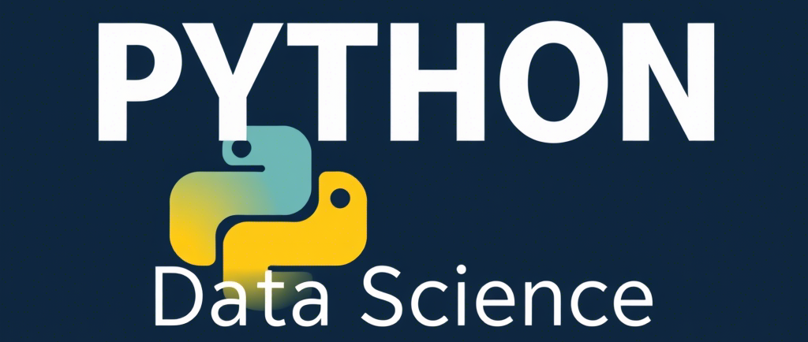

# Python 数据科学

## 介绍

b站 AI日日新 不定期更新使用Python框架完成机器学习、深度学习、数据科学任务。配套视频见[b站合集](https://www.bilibili.com/video/BV1pHd8YiERd/?spm_id_from=333.1387.homepage.video_card.click&vd_source=06eafedcfca50f6eabb7b3d6b61ecfe3)

## python的windows环境

1. 下载[python3.10](https://www.python.org/downloads/release/python-31011/)，注意选择`Windows installer (64-bit)`，在安装指引中记得勾选将python添加到路径
2. 安装目前最流行的编辑器 [vs code](https://code.visualstudio.com/Download#)，在安装指引中记得将vs code添加到path路径，并开启右键打开文件夹功能，按照安装提示完成安装后即可打开该软件，然后你需要安装 `Chinese (Simplified)` 【汉化插件】、`python`【微软官方python语言支持】、`Ruff`【格式化和语法】、`Material Icon Theme`【文件标签】、`jupyter`【notebook支持】
3. 安装完以上两个工具就已经ok了，然后我们新建一个文件夹，然后在文件夹内右键选择vs code打开。接着选择左上角的`查看` --> `终端`可以在打开的窗口运行命令
4. pip命令是python自带的包管理工具，我们需要替换pip源来提升下载速度，请运行如下命令更换源：`pip config set global.index-url https://mirrors.aliyun.com/pypi/simple`
5. 然后请再安装`uv`，它是比pip更快更强大的包管理工具，运行如下命令：`pip install uv`。然后让我们创建一个虚拟环境：`uv venv`，并且你可以初始化项目：`uv init`，还有使用与pip兼容的安装命令`uv pip install <your_package>`，或者你可以使用`uv add <your_package>`安装。因为uv的镜像配置跟pip不一致，你可以参考我当前项目下的`pyproject.toml`为当前项目配置镜像源，还有更多功能请前往[uv官网](https://docs.astral.sh/uv/)查看
6. 你可以使用 `uv sync` 命令同步本项目的依赖
   
   

## langchain

| 概念          | notebook                                                         |
|:-----------:|:----------------------------------------------------------------:|
| Few-Shot    | [少样本示例.ipynb](notebooks/少样本示例.ipynb)                             |
| RAG & Agent | [知识库问答.ipynb](notebooks/知识库问答.ipynb) |
| RAG & Agent | [联网问答.ipynb](notebooks/联网问答.ipynb)                               |

## 自然语言处理

| 任务      | notebook                                 |
|:-------:|:----------------------------------------:|
| 文本分类    | [文本分类.ipynb](notebooks/文本分类.ipynb)       |
| 实体识别    | [实体识别.ipynb](notebooks/实体识别.ipynb)       |
| 端到端文本生成 | [端到端文本生成.ipynb](notebooks/端到端文本生成.ipynb) |
| 完形填空    | [完型填空.ipynb](notebooks/完形填空.ipynb)       |
| 文本表征    | [文本表征.ipynb](notebooks/文本表征.ipynb)       |
| 文本聚类    | [文本聚类.ipynb](notebooks/文本聚类.ipynb)       |

## 计算机视觉

| 任务   | notebook                               |
|:----:|:--------------------------------------:|
| 图像分类 | [图像分类.ipynb](notebooks/图像分类.ipynb)     |
| 视频分类 | [视频分类.ipynb](notebooks/视频分类.ipynb)     |
| OCR  | [光学字符识别.ipynb](notebooks/光学字符识别.ipynb) |

## 表格中的机器学习

| 任务     | notebook                               |
|:------:|:--------------------------------------:|
| 聚类     | [聚类.ipynb](notebooks/聚类.ipynb)         |
| 分类     | [分类.ipynb](notebooks/分类.ipynb)         |
| 回归     | [回归.ipynb](notebooks/回归.ipynb)         |
| 时间序列预测 | [时间序列预测.ipynb](notebooks/时间序列预测.ipynb) |

## 音频中的深度学习

| 任务   | notebook                           |
|:----:|:----------------------------------:|
| 语音识别 | [语音识别.ipynb](notebooks/语音识别.ipynb) |

## 常见工具使用

| 工具      | 链接                                         |
|:-------:|:------------------------------------------:|
| fastapi | [fastapi_serve.py](serve/fastapi_serve.py) |
